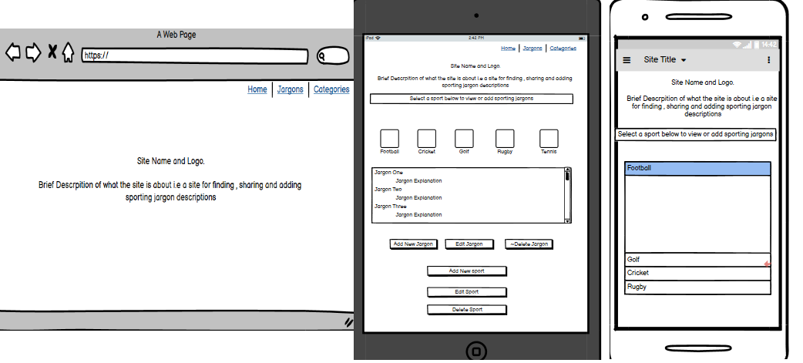

 <h1 align = "center">Milestone 3 Project<h1> 

## Data Centric Development by Martin Johnson

Jargon Buster is a website designed and built by Martin Johnson using knowledge
learnt on the Code Institute Full Stack Developers Course Modules 1- 10 which include HTML, CSS, JavaScript
and Python

The purpose of the site is to provide users with explanations for commonly used jargons from the sporting world and understand
what these jargons mean. Site users will also have the option to add, edit and delete jargons that they have heard and used themselves.

[View the live project here.](https://martinjohnson26.github.io/Milestone2-Project/) 

## User Experience (UX)

As a keen sports fan i frequently encountered sayings and jargons that i did not understand the meaning of. This inspired me to create a
website of these phrases for my personal reference and to invite other users to also add to the site in orderr to build up a glossary of
sporting jargons.

 - As a user, I want to be able to find sporting jargons and what they mean
 - As a user, i want to add my sporting jargons and descriptions
 - As a user, I want to edit my sporting jargons and descriptions
 
 - As site owner, I want to build a database of sporting jargons and descriptions
 - As site owner, I want to site users to register with the site and add there own sporting jargons and descriptions
 - As site owner, I want to have full control of the content of the database
 
 ## Wireframes

 Based on user requirements, I used [Balsamiq](https://balsamiq.com/) to create basic site layout templates for desktop,
 tablet and mobile devices. The design consists of 3 sections, a home page, a jargons section, and a 
 sports category section.

 Initial Home page design layouts are displayed below. [Full wireframes can be viewed here](static/readme_docs/wireframes/wireframes.pdf)

  

 The final design is significantly different from the original design.  The sporting category was replaced by an accordion style drop-down 
 which used an alphabetical index rather than individual sports

  ### Strategy

To create a simple and basic site for users to view a glossary of sporting jargons

  ### Scope

To allow users to add , edit and delete their own jargons

 ### Structure

The site is structured to ensure that all elements of the site are easily accessible via a navigation bar. Users are required
to log into the site to get add and edit access to the jargons

 ### Skelton

The initial design layout was created using [Balsamiq](https://balsamiq.com/). The designs are shown above in the
Wireframes section

### Surface

<!-- A team image with an opacity added to enable the text to be more visible is the landing page. -->
    
 ## Design and Website Features

<!-- -   ### Initial Design

    The initial design was created in Balsamiq. A single page site was chosen containing four sections

-   ### Colour scheme

    Claret and White have been used as the prominent colours for fonts and backgrounds on navbars and footers as they
    represent the club colours. A pale yellow has been used for hover effects again representing the clubs second choice
    colours. A light grey background was used to enhance the overall feel to the site.

    * Fonts,NavBar and footer backgrounds:  #b42424
    * Fixture Section Fonts: #000000
    * Hover effects: #E1F85E
    * Body: #eaeae1

-   ### Typography

    Ubuntu was the chosen font for its clear and easily readable text and strong characters when used with a bold font.
    Sans Serif has been selected as the fall back text should the main font fail to import correctly for any reason.

-   ### Images

    An image of the team celebrating their promotion success at Wembley has been chosen for the landing page, with a opacity
    added to enable the text to be more visible.

-   ### Site Features

    * Navigation: Permits the user to navigate to all sections of the site in a simply manner and return to the Home page
    from anywhere on the page by selecting the Home menu or by selecting the NavBar brand name or logo.

    * Fixtures Section: Opponents are listed alphabetically in sequence. Each club has a 'Show Fixtures' button which when
     selected reveals fixture dates , kick off times and stadiums. The background for each club is based on the clubs
     traditional colours. The fixtures can be hidden after viewing by clicking on the 'Hide Fixtures" button.

    * Google Maps API: Using a Google Map API the Twenty Four teams in the league have been coded to display a location
     marker. Users can scroll in and out of the map and select a marker. The marker will display an info window displaying
     an image of the stadium. Within the info window are two links. One links to the clubs official website and the other
     open a google maps directions window.

    * Contact Form: A simple contact form is used to enable the user to contact the site owner via e-mail.

    * Social Media: Links to usual social media sites are included in the footer section.

    ### Future Implementations

    * Add a search bar to the Map to enable users to search for specific needs in the vicinity of the stadiums (bars, food
     outlets etc).
    * Add a new section, possibly a blog page, that would allow users to add reviews and comments about their visit to
     the stadiums. -->

##  Technologies used

<!-- * [HTML](https://html.com/) - For the basic site code.
* [CSS](https://www.w3schools.com/css/) - For Styling.
* [Bootstrap](https://getbootstrap.com/) - For additional styling, responsiveness and layouts.
* [Google Maps API](https://developers.google.com/maps/documentation) - For the Google Map.
* [EmailJS](https://www.emailjs.com/) - For the contact form.
* [JavaScript](https://www.javascript.com/) - For the coding relating to the map and fixtures sections.
* [JavaQuery](https://jquery.com/) -  For the coding relating to the map and fixtures sections.
* [GitHub](https://github.com/) -  For version control and committing to GitHub.
* [GitPod](https://www.gitpod.io/) - For the repository to store the pushed code.
* [FontAwesome](https://fontawesome.com) -  For icon images.
* [Google Fonts](https://fonts.google.com) - For the fonts. -->

## Tools Used
<!-- 
* [Balsamiq](https://balsamiq.com/) - Used to create the wireframes on varying screen sizes.
* [W3C HTML Validator](https://validator.w3.org/) - Check the validity of HTML code.
* [W3C CSS Validator](https://jigsaw.w3.org/css-validator/) - Check the validity of CSS code.
* [Autoprefixed](https://autoprefixer.github.io/) - Check the prefixes of CSS code.
* [BeautifyTools](http://beautifytools.com/javascript-validator.php)- Check the validity of JavaScript code. -->

## Webpage and Code Testing

W3C Markup Validator, W3C CSS Validator, JSHint and PEP8 online Services were used to validate the code used and ensure
there were no syntax errors in the project. Webpages were individually tested to ensure they responded to the code as expected

* [Full testing Result](static/readme_docs/test_log.pdf)

### User story testing -  All test were manually conducted

 <!-- 1. As a user, I want to be able to see fixtures dates and kick off times

    Users are presented an easily readable navigation bar which directs them to the section containing fixture details.
    Users are presented with a clear layout of teams with a button which they can click on to reveal fixture information.
    All functions in this section have been tested and full testing details are available in the test log 
    
 2. As a user, i want to see details of the stadiums that I am going to and details about the other teams in my league.
    
    Users are presented an easily readable navigation bar which directs them to the section containing stadium information.
    They are prompted to click on markers to reveal further information via an info window. All functions in this section
     have been tested and full testing details are available in the test log.

 3.  As a user, I want to be able to get directions to the stadiums.

     Each info window contains a directions link to the stadium. All functions in this section have been tested and full
     testing details are available in the test log.

 4. As a user, I want to be able to contact the site owner and ask for more information.

    Users are presented an easily readable navigation bar which directs them to the section containing the contact form.
    There is a simple contact form which prompts the user to complete the fields correctly. All functions in this section
    have been tested and full testing details are available in the test log.

    [The full test log can be viewed here](assets/readme_docs/testlog.pdf) -->

## Deployment

### GitHub Pages

<!-- To deploy my site I used GitHub and the following steps:

1. Logged into my GitHub account.
1. Went to my repositories and selected my project.
1. Clicked the Settings icon.
1. Scrolled down the page to the 'GitHub Pages' section
1. I selected 'Master branch' in the dropdown
1. This deployed my project to the URL: https://martinjohnson26.github.io/Milestone2-Project/ -->

### Forking the repository

<!-- 1.  Log in to GitHub and locate the GitHub Repository
1.  At the top of the Repository above the "Settings" Button on the menu, locate the "Fork" Button.
1.  Click the button to create a copy of the original repository in your GitHub account. -->

### Make a local clone
<!-- 
1. Log in to GitHub and locate the GitHub Repository
1. Under the repository name, click "Clone or download".
1. To clone the repository using HTTPS, under "Clone with HTTPS", copy the link.
1. Open Git Bash
1. Change the current working directory to the location where you want the cloned directory to be made.
1. Type git clone, and then paste the URL you copied in Step 3.
1. Press Enter. Your local clone will be created. -->

## Credits

**Content:** 
<!-- The core HTML, CSS and JS code has been written by myself. Templates taken from [Bootstrapbay](https://bootstrapbay.com/blog/14-days-bootstrap-4/)
were used for the NavBar and fixtures section and modified by myself to meet the needs of the site. The email.JS code was taken from the 
Code Institute Interactive Frontend Development module lessons. The core code for the Google Maps API was taken from following
a YouTube video by [Traversy Media](https://www.youtube.com/watch?v=Zxf1mnP5zcw&t=1445s) and modifying to meet site requirements.
Bootstrap 4 was used to assist with site responsivness and layout -->

**Media**  
 <!-- Icons were sourced from FontAwesome  (https://fontawesome.com)

 Images were sourced from Wikipediae (https://en.wikipedia.org)

 Fonts were sourced from Google Fonts (https://fonts.google.com/) -->

**Acknowledgements**

<!-- https://www.w3schools.com/bootstrap4/ For use of built in class definitions, examples and Try Me Code snippets

Slack community for support and advice during the construction of the site

Code Institute tutors for support and advice during the construction of the site

Code Institute coursework for reference

Traversy Media for YouTube videos related to Google Maps API's

Codecademy for additional tutorials relating to JavaScript

Oluwafemi Medale (CI Mentor) for help, support, advice and positive feedback from the initial inception of the site through to completion
 -->

